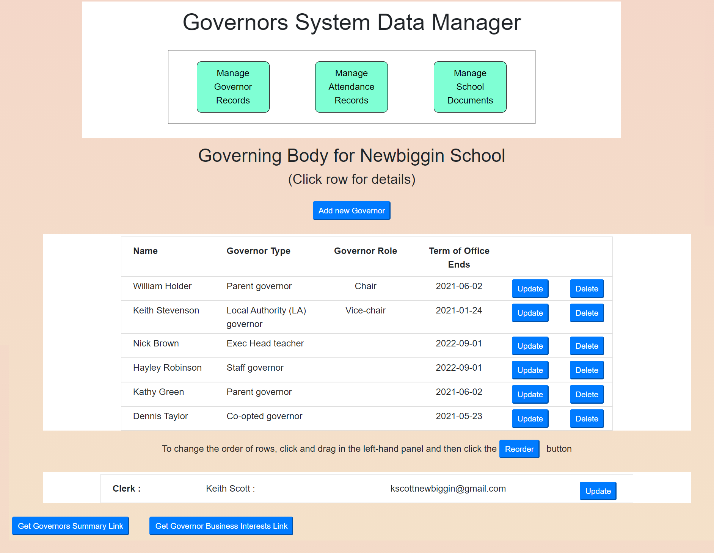
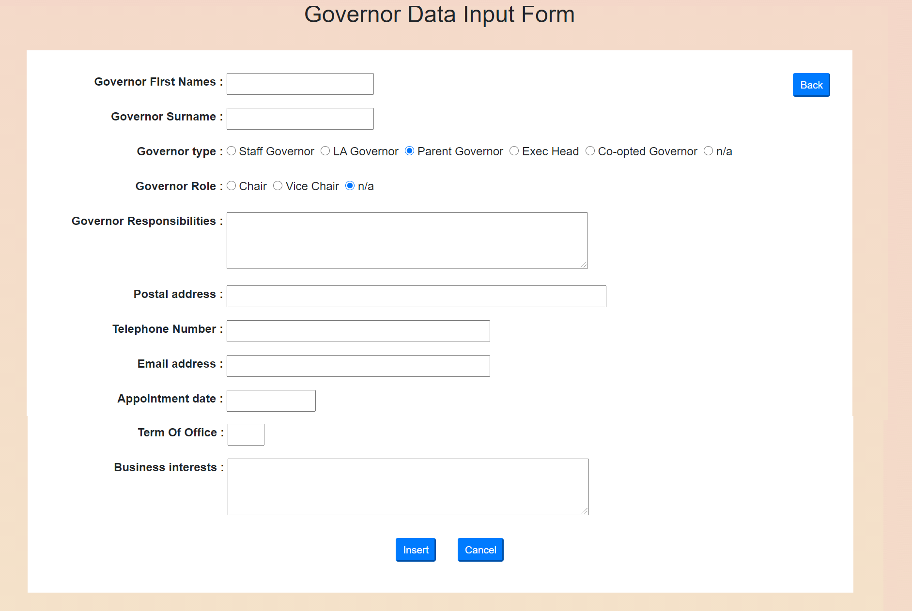
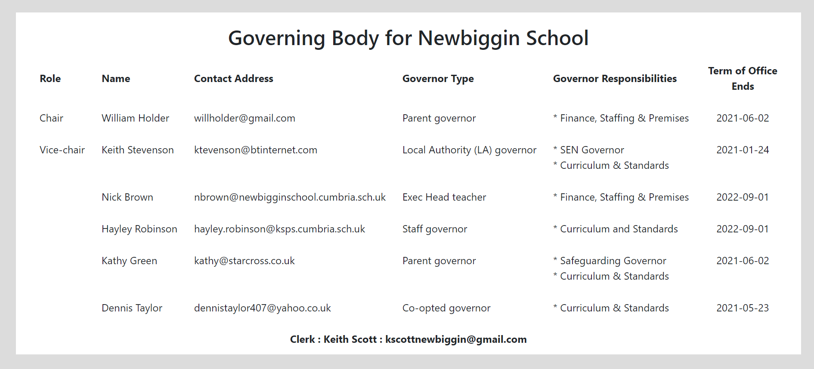
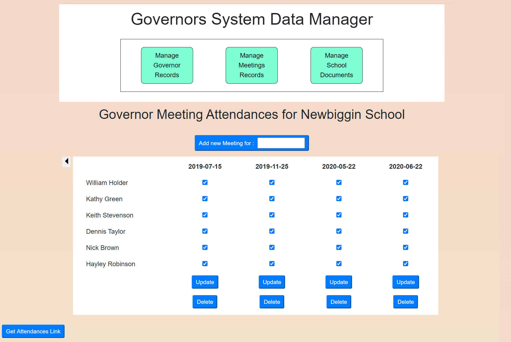
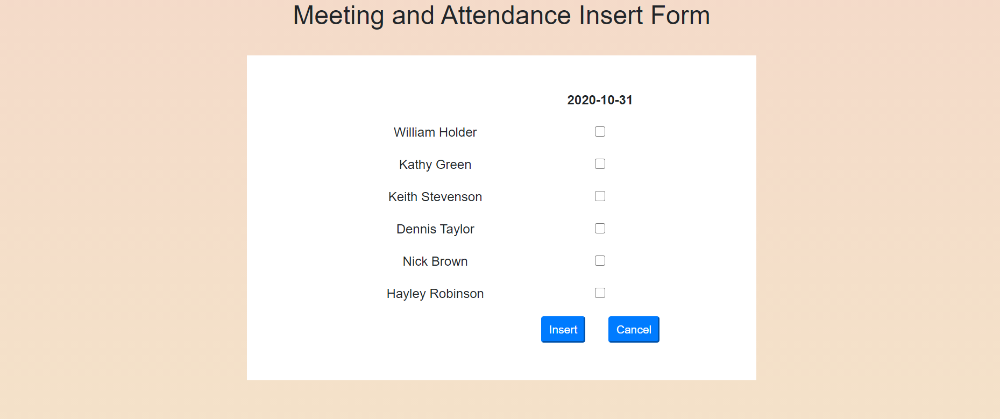
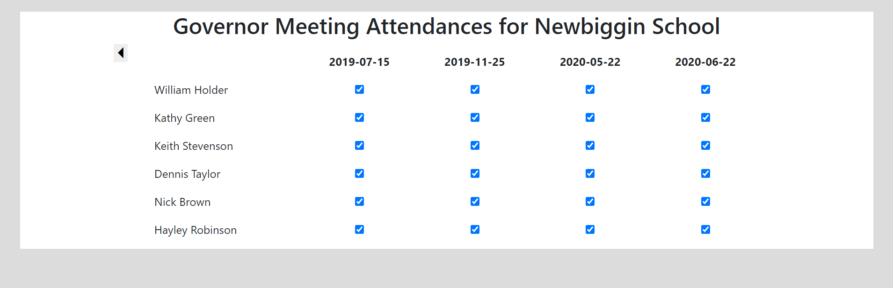
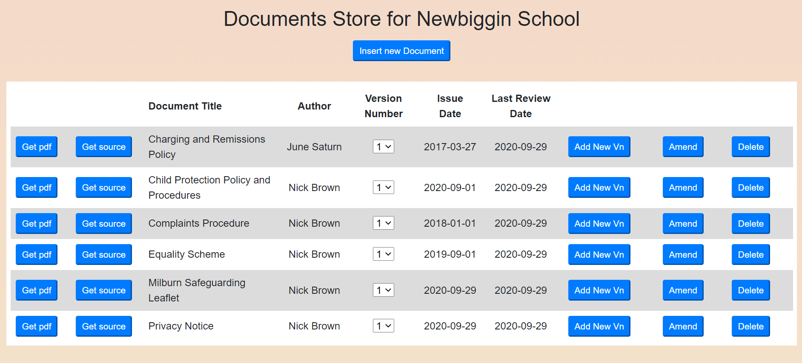

## User Guide to the *governors* System

Governor data is administered through the manager.html page. If the system has been installed in url "mygovernors.com", the manager page is launched by referencing url mygovernors.com/manager.html

The system will respond by requesting user-id and password credentials. These  will have been supplied when you register for use of the system and associate your user_id (typically a clerk email address) with the school's entries in the system's data-stores.

The system targets three areas of data : governor-details, meeting-details/governor-attendances and school documents. The system's focus is switched by clicking one of the three buttons displayeed in the top panel of the screen. By default, the system is initially focussed on Governor details and displays, in the lower panels, a summary of the members of the governog body together with associated data-management buttons.

## Governor Details

On successful login, the system will display a set of control buttons and a summary of the data for the school's governing body. A screen-shot for demo school "Newbiggin" is shown below.

Clicking the "Add new governor" button reveals a governor insert form:

Back on the Governor summary panel, the update and delete buttons provide tools to manage reords for individual governors. Following repeated changes to the Governng Body, it may be felt that the order of the records displayed in the table is not best suited to display on the website. In this case, "drag and drop" can be used to change the order. Once the "Reorder" button is clicked, the new ordering will be applied permanently to the data-store. Retirement of a Governor from the Governong Body is signalled by their record.

Every Governing Body must have a clerk so a dummy record is created automatically when a new school is registered and is immediately available for amendment.

At the bottom of the screen, two buttons are available to display links to pages tailored expressly for display on the schools website. Because display of Governor business interests can be sensitive and not every school will wish to offer these details, these are offered through a separate button from the main button, which displays details of governor names, types (eg parent-governor), role (eg Chair) and contact details. When clicked, these buttons launch the pages as new tabs in the web browser. These tabs reveal the url for the pages and it is expected that cut and paste will be used to create links in the school's website. See below for an example of the Governor summary page 

## Meetings Data

Clicking the "Manage Meetings Records" buttons reveals a summary of the attendance at the most recent governor meetings

A new meeting is inserted into the system's data-store by using a "datepicker" to enter the meeting's date in the add new meeting" button. This in turn reveals an attendance-input form as shown below:

A governor's attendance at the new meeting is recorded by clicking the associated checkbox. The completed record is recorded permanently in the data store by clicking the Insert button and the meeting summary is re-displayed. If it is realised that further amendment is required, this can be achieved by adjusting the checkboxes for a meeting and clicking the Update button.

Note that, although the meetings summary screen only displays the most recent four meeting, the full meeting history is available and can be revealed by clicking the "caret" symbol to left of the summary display. Note, however, that once a governor has been deleted, records of their attendance at meetings are also deleted so, after a while, the erliest records for a school will be empty.

A website page to display Governor Meeting Attendance is availble from the "Get Attendances Link" button at the foot of the page. An example is shown below:

## Documents Data

A school's Governing Body is responsible for initiating and approving many of its policies. These documents will start life in the school's office systems where they are likely to be exchanged between staff members and governors by Microsoft OneDrive or Google's Dropbox. At some point, however, once approved, document versions become fixed and need to be published on the school's website. The governors system provides a simple document management facility to create permanent records of documents once they reach this stage. Documents are identified by "document title" and tagged by version number. For each version, the system stores both a copy of the orginal source (to provide a baseline for production of the next version) and a corresponding pdf version (for display on the school's website). In this way the system captures the milestone "release" history of key documents.

Provision of a "changes log" to compare the source of successive versions is beyond the scope of the governors system, but it can at least ensure that the source files for these versions are available for download and manual comparison.

An example of the management screen for creating and updating document records is shown below:

As can be seen, the screen allows you to record both completely new documents (ie documents relating to a completely new topic and thus identified by a new title) and new versions of existing documents. In both cases, the user needs to declare local filenames for both the source (typically a docx file) and a corresponding pdf version for upload to the server. Once a version history is established, the system permits changes to the "author", "issue date" and "last review date" of the latest version, but if changes to the local files are to be uploaded a completely new version must be created.

Where a document needs to be displayed on the school's website, the "Get pdf link" button may be used to display the associated pdf version. Where this is used to display the pdf file for the latest version of the document, the link produced will be tagged as "latest" and, if inserted into the school website, will automatically point the website to the latest version - ie any new version added to the document store will automatically also appear on the website without further intervention.

In the case where one needs to review an earlier version of a document, the "pull-down" list on the version number field for the document can be used to select this version.

MartinJ

